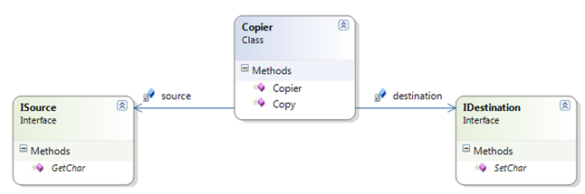

# :paperclip: Character Copy Kata :paperclip:

## Resources

These instructions where extracted from Urls Enzler blog. The link to the original instructions can be found in the link bellow.

## Description

The character copier is a simple class that reads characters from a source and copies them to a destination one character at a time.

The character copier gets the source and destination injected in the constructor.

When the method Copy is called on the copier then it should read characters from the source and copy them to the destination until the
source returns a newline (‘\n’).

The exercise is to implement the character copier using mocks for the source and the destination (try using manually written mocks and
mocks written with a mocking framework.

## Objective

The objective of the kata is to practice Mocking and Stubs to test a class without depending on other classes.

We will try to work with the concept of baby steps and compare manually writen mocks with mocks written with a mocking framework.

## Visit my GitHub profile to see all solved katas 🚀

