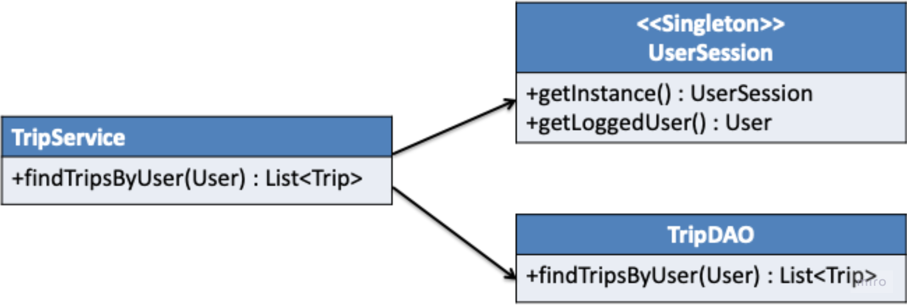

# :airplane: Trip Service Kata :airplane:

## Resources

These instructions where extracted from Sandro Mancuso GitHub. The link to the original instructions can be found in the link bellow.

## Description

Imagine a social networking website for travellers:

- You need to be logged in to see the content
- You need to be a friend to see someone else's trips
- If you are not logged in, the code throws an exception

Our job is to write tests for the `TripService` class until we have 100% coverage.

Once we have 100% coverage, we need to refactor and make the code better. At the end of the refactoring, both tests and production code 
should clearly describe the business rules.

### Constraints

- We cannot manually change production code if not covered by tests
- If we need to change the TripService class in order to test, we can do so using automated refactorings (via IDE)
- We CANNOT change the public interface of TripService
- We CANNOT introduce state in the `TripService`. `TripService` is stateless. Introducing state may cause multi-thread issues
- Unit tests for TripService must not call the real UserSession and TripDAO. It should solely focus on the TripService. The real classes
have dependencies on resources (HTTP session, database) that are not available at unit test level. Unit tests will break if involving
the real collaborators.

## Objective

The main objective is to learn how to test legacy code using steams, mocks and stubs when needed.

## Visit my GitHub profile to see all solved katas 🚀

